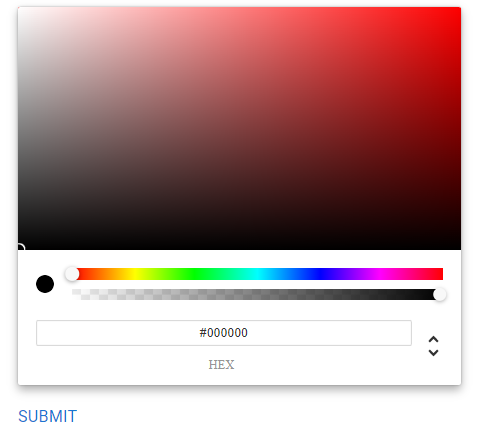

# Color Picker 

Color picker for Universal Dashboard.



## Install

```powershell
Install-Module UniversalDashboard.ColorPicker
```

## Usage

Create a default Material UI color picker.

```powershell
New-UDColorPicker 
```

Create a Chrome color picker.

```powershell
New-UDColorPicker -Variant chrome
```

Use in a form.

```powershell
New-UDForm -Children {
    New-UDStyle -Style "width: 25%" -Content {
        New-UDColorPicker -Id 'iconColor' -Variant chrome
    }
} -OnSubmit {
    $Color = (Get-UDElement -Id 'iconColor').color.hex
    Show-UDToast $Color
}
```